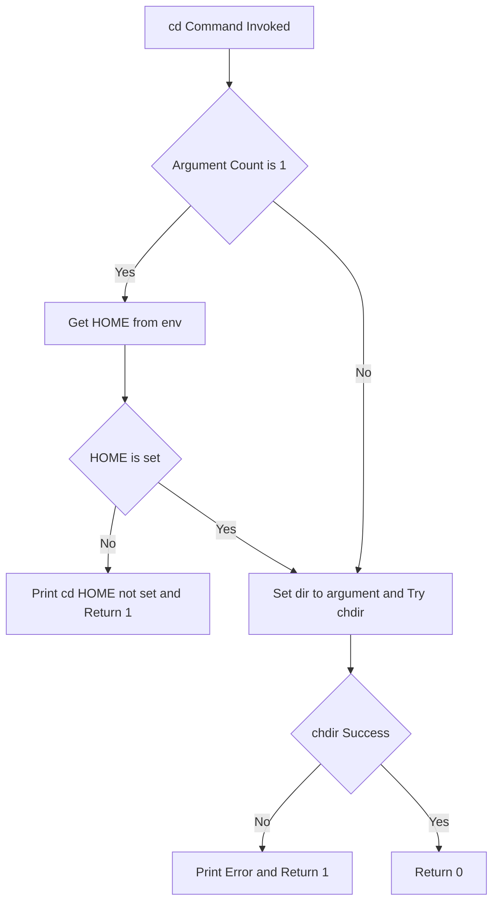

```mermaid
flowchart TD
    A[cd Command Invoked] --> B{Argument Count is 1}
    B -- Yes --> C[Get HOME from env]
    C --> D{HOME is set}
    D -- No --> E[Print cd HOME not set and Return 1]
    D -- Yes --> H[Set dir to HOME and Try chdir]
    B -- No --> H[Set dir to argument and Try chdir]
    H --> I{chdir Success}
    I -- No --> J[Print Error and Return 1]
    I -- Yes --> K[Return 0]
```