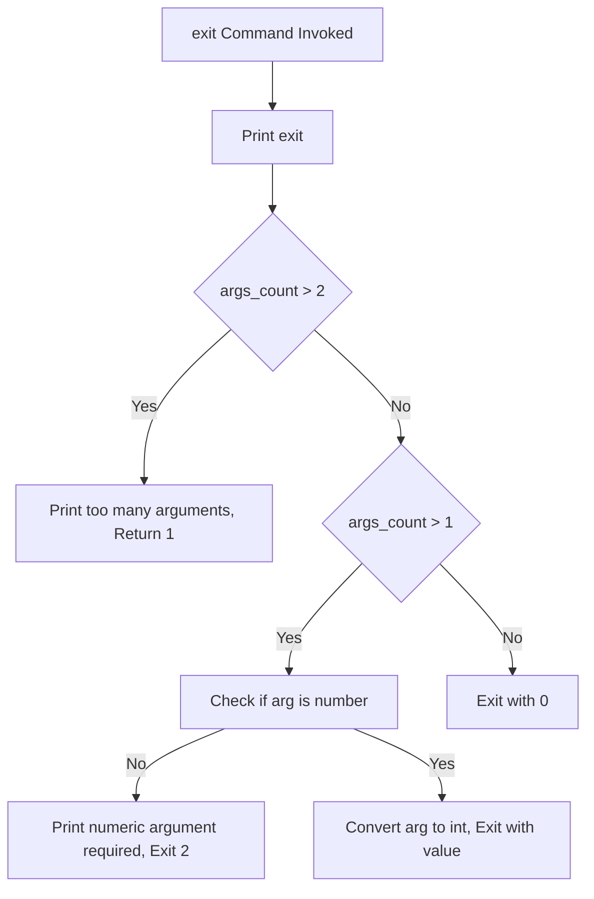

```mermaid
flowchart TD
    A[exit Command Invoked] --> B[Print exit]
    B --> C{args_count > 2}
    C -- Yes --> D[Print too many arguments, Return 1]
    C -- No --> E{args_count > 1}
    E -- Yes --> F[Check if arg is number]
    F -- No --> G[Print numeric argument required, Exit 2]
    F -- Yes --> H[Convert arg to int, Exit with value]
    E -- No --> I[Exit with 0]
```
