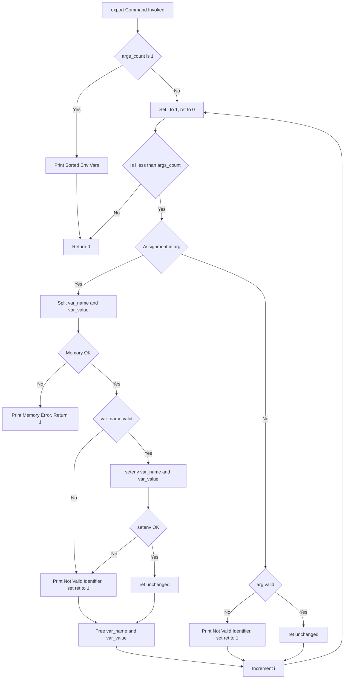

```mermaid
flowchart TD
    A[export Command Invoked] --> B{args_count is 1}
    B -- Yes --> C[Print Sorted Env Vars]
    C --> Z[Return 0]
    B -- No --> D[Set i to 1, ret to 0]
    D --> E{Is i less than args_count}
    E -- No --> Z
    E -- Yes --> F{Assignment in arg}
    F -- Yes --> G[Split var_name and var_value]
    G --> H{Memory OK}
    H -- No --> I[Print Memory Error, Return 1]
    H -- Yes --> J{var_name valid}
    J -- No --> K[Print Not Valid Identifier, set ret to 1]
    J -- Yes --> L[setenv var_name and var_value]
    L --> M{setenv OK}
    M -- No --> K
    M -- Yes --> N[ret unchanged]
    K --> O[Free var_name and var_value]
    N --> O
    O --> P[Increment i]
    P --> D
    F -- No --> Q{arg valid}
    Q -- No --> R[Print Not Valid Identifier, set ret to 1]
    Q -- Yes --> S[ret unchanged]
    R --> P
    S --> P
```
