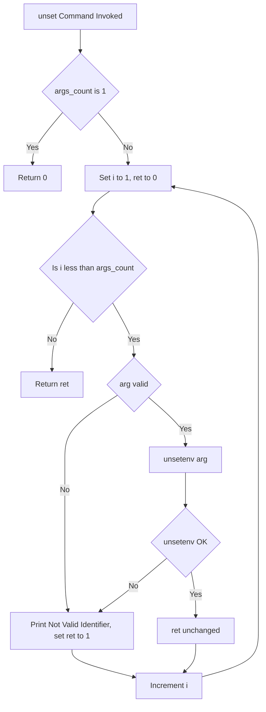

```mermaid
flowchart TD
    A[unset Command Invoked] --> B{args_count is 1}
    B -- Yes --> C[Return 0]
    B -- No --> D[Set i to 1, ret to 0]
    D --> E{Is i less than args_count}
    E -- No --> F[Return ret]
    E -- Yes --> G{arg valid}
    G -- No --> H[Print Not Valid Identifier, set ret to 1]
    G -- Yes --> I[unsetenv arg]
    I --> J{unsetenv OK}
    J -- No --> H
    J -- Yes --> K[ret unchanged]
    H --> L[Increment i]
    K --> L
    L --> D
```
