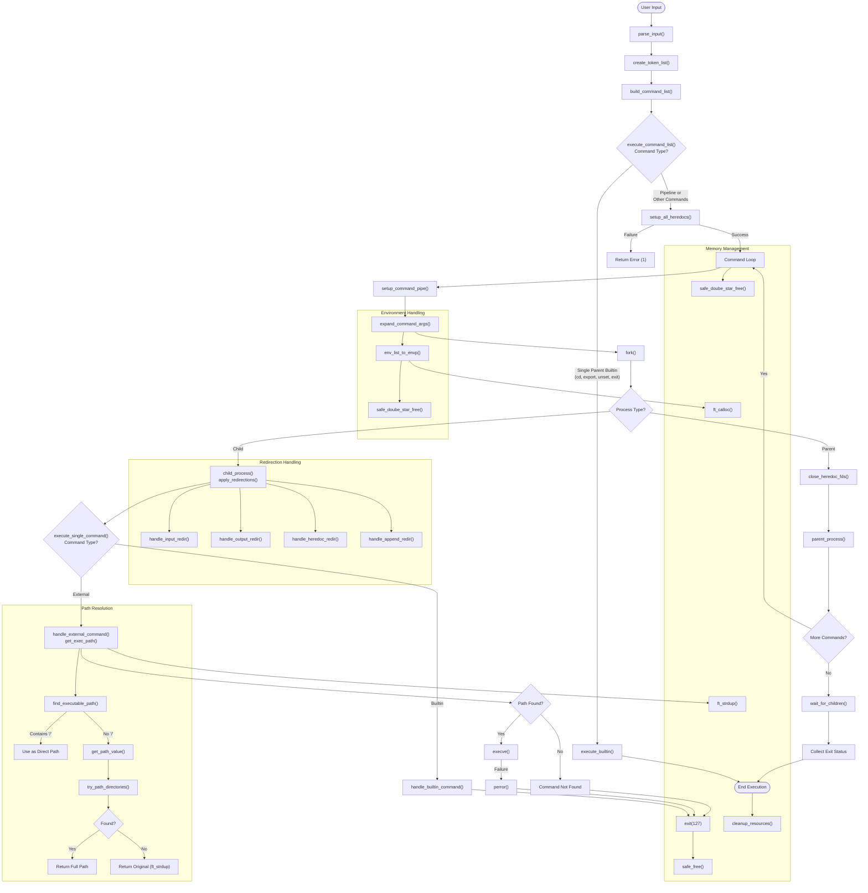

# Minishell Execution Flow

This diagram illustrates the full execution process of commands in minishell, from parsing to command execution, including the specific function names from the codebase.

## Key Functions in Execution Flow

1. **Command Parsing & Setup**
   - `execute_command_list()`: Main function coordinating command execution
   - `setup_all_heredocs()`: Prepares all heredoc redirections before execution
   - `setup_command_pipe()`: Sets up pipes between commands

2. **Command Execution**
   - `child_process()`: Handles execution in child processes
   - `handle_builtin_command()`: Executes shell builtin commands
   - `handle_external_command()`: Handles execution of external programs
   - `execute_single_command()`: Routes commands to builtin or external handler

3. **Path Resolution**
   - `get_exec_path()`: Gets executable path using temp environment
   - `find_executable_path()`: Searches for command in PATH directories 

4. **Environment Management**
   - `env_list_to_envp()`: Converts internal environment to execve format
   - `expand_command_args()`: Expands environment variables in commands

5. **Process & Pipe Management**
   - `parent_process()`: Manages pipes in parent shell
   - `wait_for_children()`: Waits for all child processes and collects status

6. **Memory Management**
   - `safe_doube_star_free()`: Safely frees string arrays
   - `safe_free()`: Safely frees individual pointers