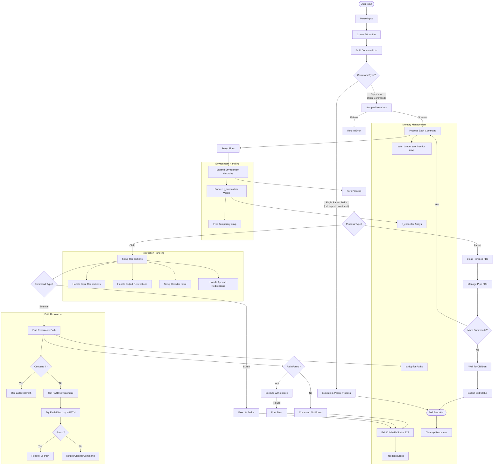

# Minishell Execution Flow

This diagram illustrates the full execution process of commands in minishell, from parsing to command execution.

## Key Components

1. **Command Execution Decision**
   - Parent builtins (cd, export, unset, exit) run in parent process
   - Other commands run in child processes

2. **Piping and Redirection**
   - Pipes connect stdout of one command to stdin of next command
   - Redirections modify stdin/stdout for each command

3. **Path Resolution**
   - Direct paths (containing '/') are used as-is
   - Other commands are searched in PATH directories

4. **Process Management**
   - Child processes execute commands and exit
   - Parent process waits for and collects exit status

5. **Environment Management**
   - Internal t_env list is converted to execve-compatible format
   - Proper memory management for environment variables

6. **Heredoc Handling**
   - All heredocs are set up before execution starts
   - Heredoc file descriptors are managed during execution