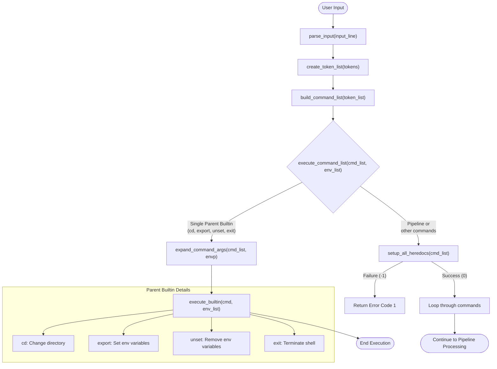

# Command Evaluation Flow

This diagram shows how minishell evaluates and decides how to execute different types of commands.

## Key Functions Details

- `execute_command_list(t_command *cmd_list, t_env **env_list)`: 
  - Evaluates command type: single builtin vs pipeline
  - For parent builtins: expands variables then runs directly
  - For pipelines: sets up heredocs, pipes, handles processes
  - Returns: status code from command execution (0-255)

- `is_parent_builtin(char *cmd)`: 
  - Checks commands that must run in parent process
  - Returns: 1 for "cd", "export", "unset", "exit"; 0 otherwise
  - Implementation: Simple string comparison with ft_strcmp

- `execute_builtin(t_command *cmd, t_env **env_list)`:
  - Routes to specific builtin function based on command name
  - Handles: cd, echo, pwd, export, unset, env, exit
  - Returns: Exit status from builtin (typically 0 for success)

- `setup_all_heredocs(t_command *cmd_list)`:
  - Creates temp files for all heredoc redirections
  - Processes: <<EOF type redirections
  - Returns: -1 on error, 0 for success