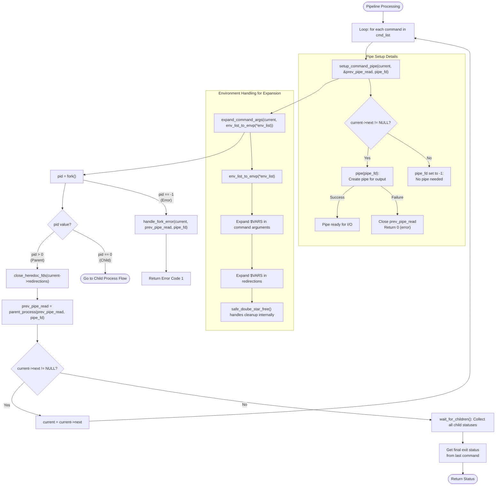

# Pipeline Processing Flow

This diagram shows how minishell processes commands in a pipeline with detailed function parameters and behaviors.

## Key Functions Details

- `setup_command_pipe(t_command *current, int *prev_pipe_read, int pipe_fd[2])`:
  - Creates pipes between commands in a pipeline
  - For last command: sets pipe_fd to -1 (no output pipe needed)
  - For other commands: creates pipe using pipe() system call
  - Returns: 1 on success, 0 on failure (pipe creation error)

- `expand_command_args(t_command *cmd, char **envp)`:
  - Expands environment variables in command arguments and redirections
  - Handles expansion of $VARIABLES to their values
  - Takes temporary envp array that is freed internally
  - After expansion: command is ready for execution with real values

- `parent_process(int prev_pipe_read, int pipe_fd[2])`:
  - Manages parent's pipe file descriptors after fork
  - Closes pipe_fd[1] (write end) as parent doesn't write
  - Closes prev_pipe_read if it was open
  - Returns: pipe_fd[0] (read end) for next command or -1

- `close_heredoc_fds(t_redirections *redir)`:
  - Closes all heredoc file descriptors to prevent leaks
  - Only closes FDs for TOKEN_HEREDOC type redirections
  - Prevents resource leaks in parent process

- `wait_for_children()`:
  - Uses waitpid() to wait for all child processes
  - Collects exit status using WEXITSTATUS macro
  - Sets global exit status for "$?" expansion
  - Returns: Exit status of last command in pipeline