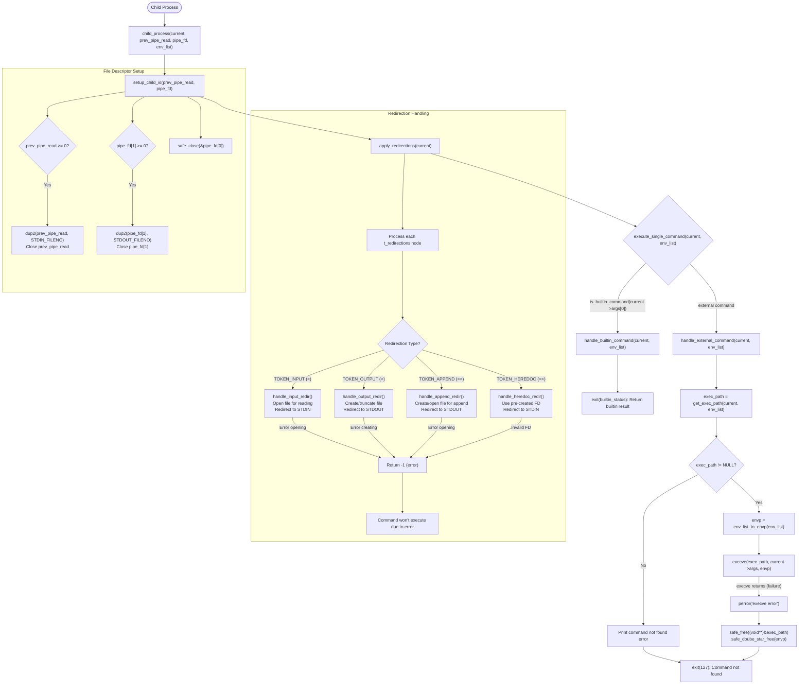

# Child Process Execution Flow

This diagram shows in detail how commands are executed in child processes including redirection handling and error management.

## Key Functions Details

- `child_process(t_command *current, int prev_pipe_read, int pipe_fd[2], t_env *env_list)`:
  - Entry point for executing commands in child processes
  - Sets up input/output pipes for command in pipeline
  - Applies all redirections specified in command
  - Calls execute_single_command() to run the command
  - Never returns - process is replaced or exits with status code

- `setup_child_io(int prev_pipe_read, int pipe_fd[2])`:
  - Configures standard input/output for pipeline commands
  - Redirects stdin from prev_pipe_read if available
  - Redirects stdout to pipe_fd[1] if available
  - Closes unused pipe ends to prevent leaks
  - Returns: void - child process always continues

- `apply_redirections(t_command *cmd)`:
  - Processes all redirections in command (>, <, >>, <<)
  - Opens files and sets up file descriptors
  - For each redirection: calls appropriate handler function
  - Returns: 0 on success, -1 if any redirection fails

- `handle_external_command(t_command *current, t_env *env_list)`:
  - Resolves executable path using PATH environment
  - Converts environment to format needed by execve
  - Attempts to run command using execve() system call
  - On failure: frees resources and exits with status 127
  - Never returns on success (process is replaced by command)

- `handle_builtin_command(t_command *current, t_env *env_list)`:
  - Executes shell builtins in child process context
  - Captures return status from builtin function
  - Exits child process with builtin's status code
  - Handles: echo, pwd, env (non-parent builtins)