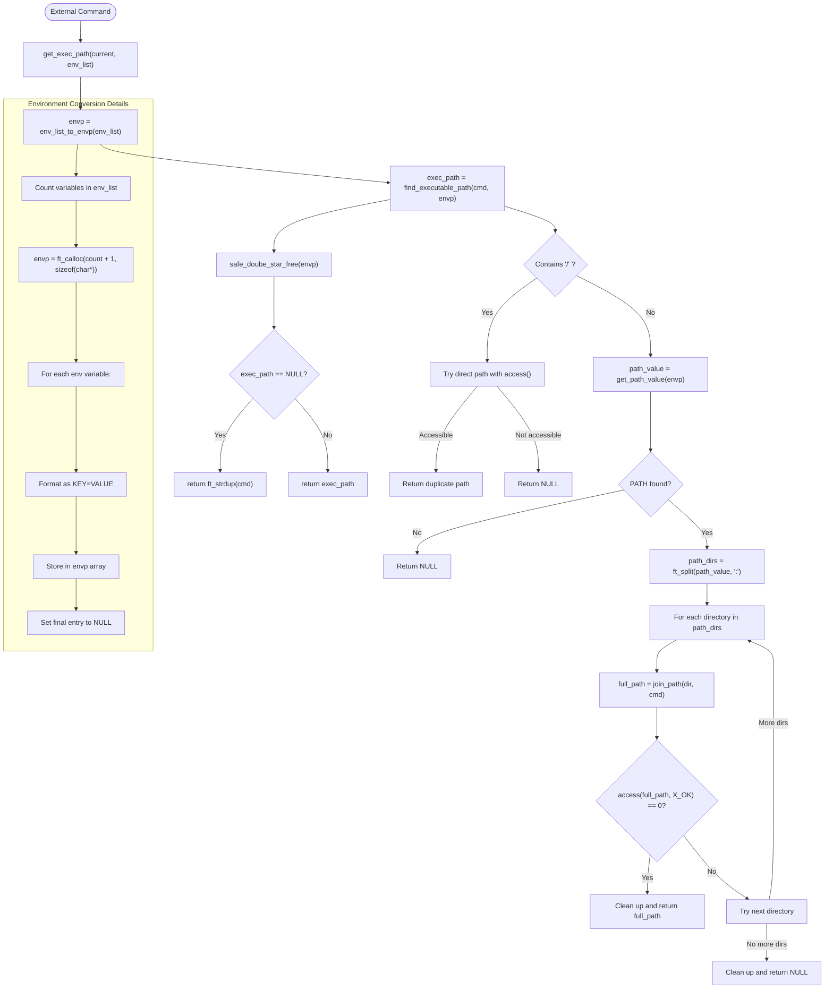

# Path Resolution & Environment Flow

This diagram shows how minishell resolves executable paths and handles environment variables with additional implementation details.

## Key Functions Details

- `get_exec_path(t_command *current, t_env *env_list)`:
  - Creates temporary environment array using env_list_to_envp()
  - Calls find_executable_path() to locate the command
  - Frees temporary environment immediately after use
  - If command not found in PATH, returns a copy of the command name
  - Implementation detail: Uses ft_strdup() for returning paths

- `find_executable_path(char *cmd, char **envp)`:
  - First checks if cmd contains '/' - if so, validates as direct path
  - Otherwise gets PATH from environment and splits into directories
  - For each directory: Creates full path and checks using access()
  - Memory management: Properly frees split path array on all return paths
  - Return: Full resolved path that can be executed or NULL if not found

- `env_list_to_envp(t_env *env_list)`:
  - Now uses ft_calloc() instead of malloc() for safety (array zero-initialized)
  - Creates "KEY=VALUE" strings for each environment variable
  - For variables without values: Creates "KEY=" format
  - Implementation: Uses ft_strlcpy/ft_strlcat for safe string operations
  - Memory management: Properly handles allocation failures in sub-steps

- `join_path(char *dir, char *cmd)`:
  - Safely combines directory path and command name
  - Ensures proper '/' separator between directory and command
  - Implementation: Handles cases where directory already ends with '/'
  - Memory management: Returns newly allocated string that caller must free