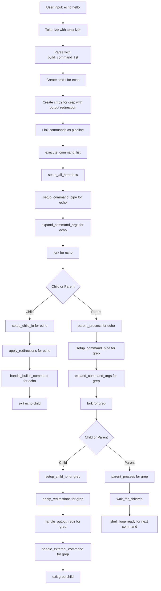

# Example Command Execution Flow (Step-by-Step)

This flowchart matches the step-by-step explanation for:

echo hello | grep hello > outputfile

---

This flowchart follows the plain-language explanation, showing each major step and decision in the execution of the pipeline command.