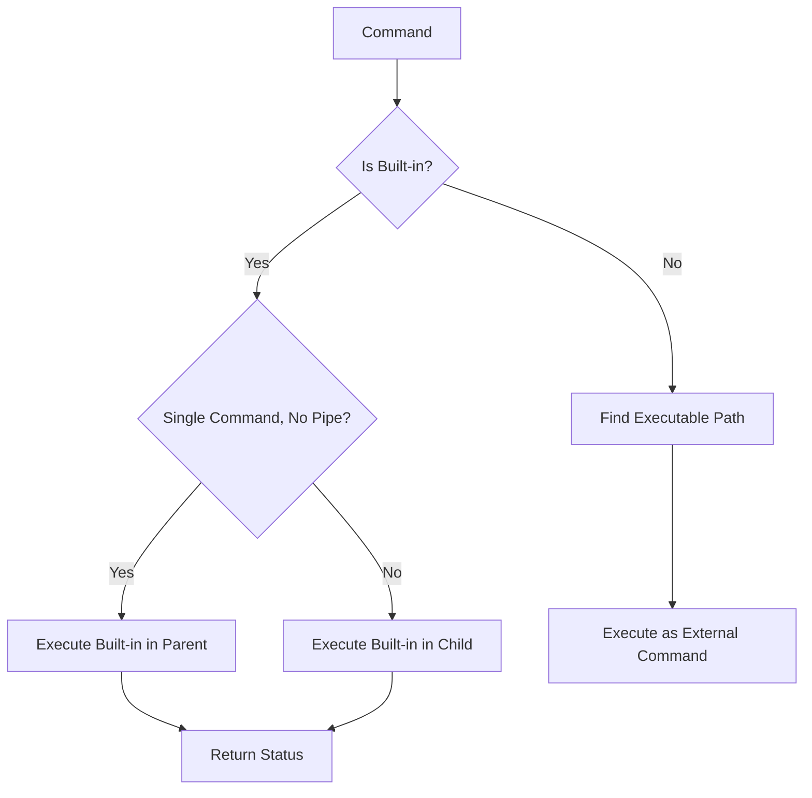

```mermaid
flowchart TD
    A[Command] --> B{Is Built-in?}
    B -- Yes --> C{Single Command, No Pipe?}
    C -- Yes --> D[Execute Built-in in Parent]
    D --> F[Return Status]
    C -- No --> E[Execute Built-in in Child]
    E --> F
    B -- No --> G[Find Executable Path]
    G --> H[Execute as External Command]
```
