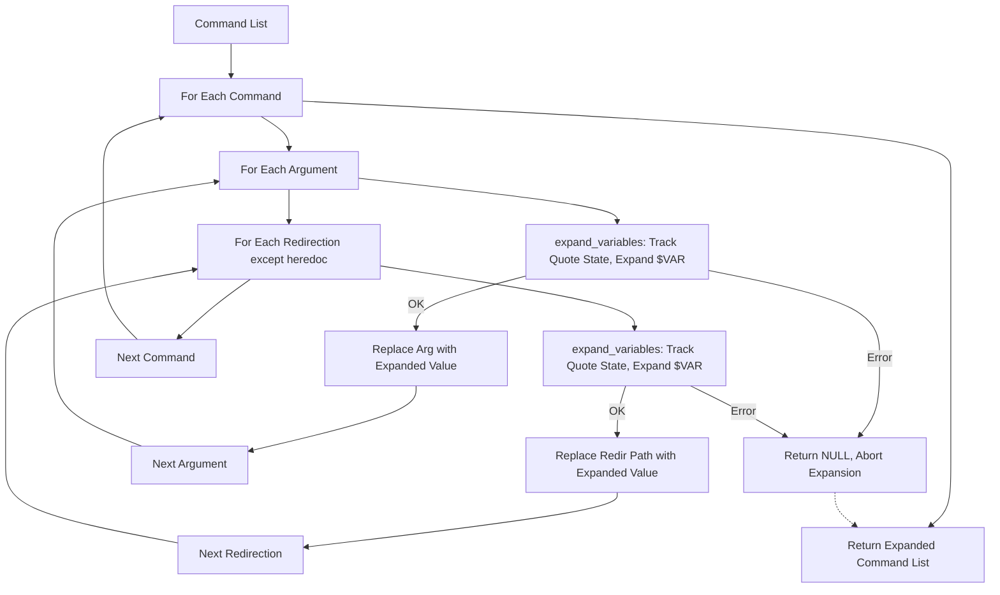

```mermaid
flowchart TD
    A[Command List] --> B[For Each Command]
    B --> C[For Each Argument]
    C --> D[expand_variables: Track Quote State, Expand $VAR]
    D -- Error --> Z[Return NULL, Abort Expansion]
    D -- OK --> E[Replace Arg with Expanded Value]
    E --> F[Next Argument]
    F --> C
    C --> G[For Each Redirection except heredoc]
    G --> H[expand_variables: Track Quote State, Expand $VAR]
    H -- Error --> Z
    H -- OK --> I[Replace Redir Path with Expanded Value]
    I --> J[Next Redirection]
    J --> G
    G --> K[Next Command]
    K --> B
    B --> L[Return Expanded Command List]
    Z -.-> L
```
