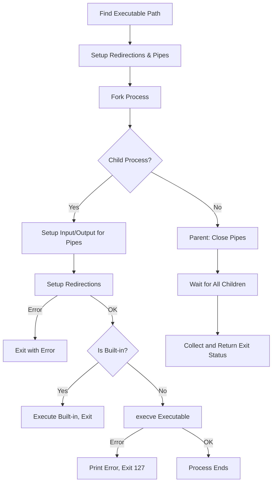

```mermaid
flowchart TD
    A[Find Executable Path] --> B[Setup Redirections & Pipes]
    B --> C[Fork Process]
    C --> D{Child Process?}
    D -- Yes --> E[Setup Input/Output for Pipes]
    E --> F[Setup Redirections]
    F -- Error --> G[Exit with Error]
    F -- OK --> H{Is Built-in?}
    H -- Yes --> I[Execute Built-in, Exit]
    H -- No --> J[execve Executable]
    J -- Error --> K[Print Error, Exit 127]
    J -- OK --> L[Process Ends]
    D -- No --> M[Parent: Close Pipes]
    M --> N[Wait for All Children]
    N --> O[Collect and Return Exit Status]
```
