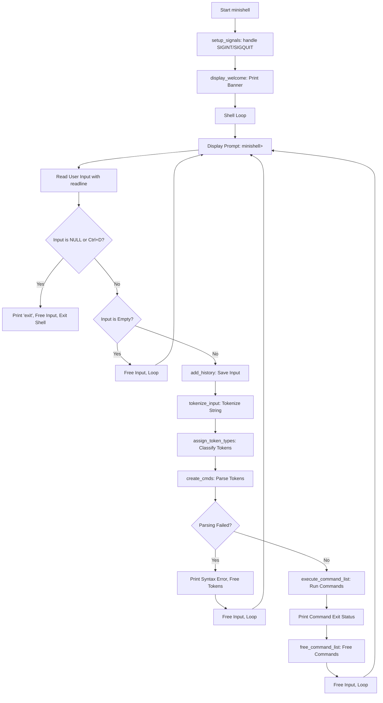

```mermaid
flowchart TD
    A[Start minishell] --> B[setup_signals: handle SIGINT/SIGQUIT]
    B --> C[display_welcome: Print Banner]
    C --> D[Shell Loop]
    D --> E[Display Prompt: minishell> ]
    E --> F[Read User Input with readline]
    F --> G{Input is NULL or Ctrl+D?}
    G -- Yes --> H[Print 'exit', Free Input, Exit Shell]
    G -- No --> I{Input is Empty?}
    I -- Yes --> J[Free Input, Loop]
    J --> E
    I -- No --> K[add_history: Save Input]
    K --> L[tokenize_input: Tokenize String]
    L --> M[assign_token_types: Classify Tokens]
    M --> N[create_cmds: Parse Tokens]
    N --> O{Parsing Failed?}
    O -- Yes --> P[Print Syntax Error, Free Tokens]
    P --> Q[Free Input, Loop]
    Q --> E
    O -- No --> R[execute_command_list: Run Commands]
    R --> S[Print Command Exit Status]
    S --> T[free_command_list: Free Commands]
    T --> U[Free Input, Loop]
    U --> E
```
