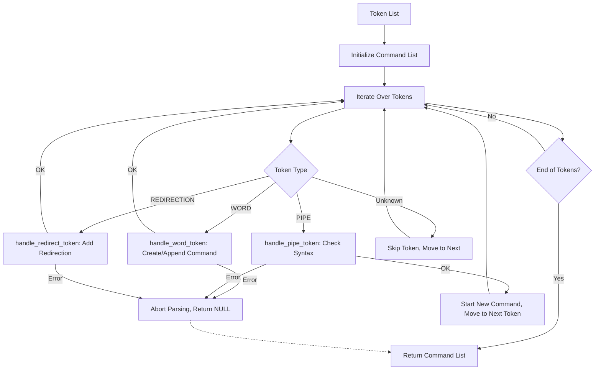

```mermaid
flowchart TD
    A[Token List] --> B[Initialize Command List]
    B --> C[Iterate Over Tokens]
    C --> D{Token Type}
    D -- WORD --> E[handle_word_token: Create/Append Command]
    E -- Error --> Z[Abort Parsing, Return NULL]
    E -- OK --> C
    D -- PIPE --> F[handle_pipe_token: Check Syntax]
    F -- Error --> Z
    F -- OK --> G[Start New Command, Move to Next Token]
    G --> C
    D -- REDIRECTION --> H[handle_redirect_token: Add Redirection]
    H -- Error --> Z
    H -- OK --> C
    D -- Unknown --> I[Skip Token, Move to Next]
    I --> C
    C --> J{End of Tokens?}
    J -- No --> C
    J -- Yes --> K[Return Command List]
    Z -.-> K
```
