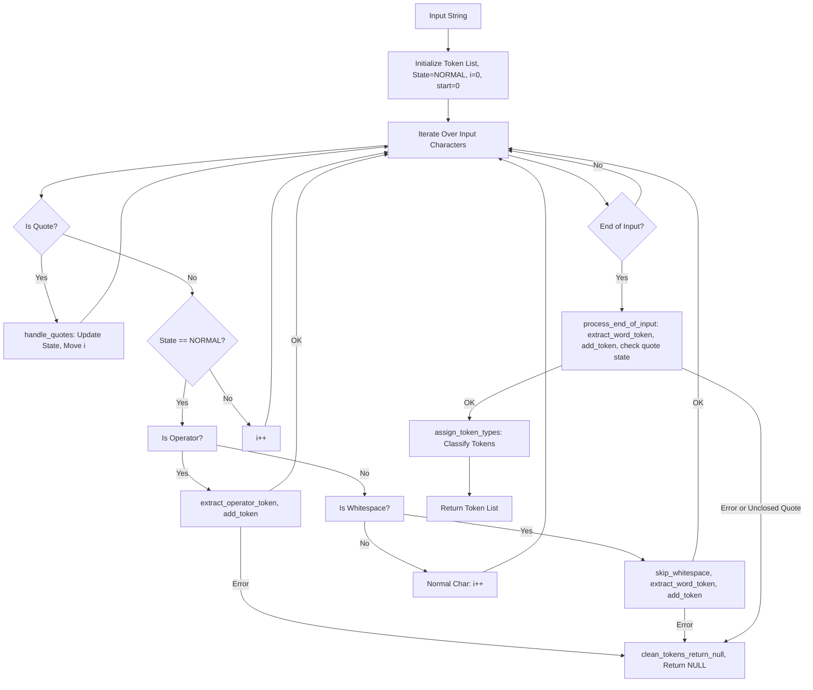

```mermaid
flowchart TD
    A[Input String] --> B[Initialize Token List, State=NORMAL, i=0, start=0]
    B --> C[Iterate Over Input Characters]
    C --> D{Is Quote?}
    D -- Yes --> E[handle_quotes: Update State, Move i]
    E --> C
    D -- No --> F{State == NORMAL?}
    F -- Yes --> G[Is Operator?]
    G -- Yes --> H[extract_operator_token, add_token]
    H -- Error --> Z[clean_tokens_return_null, Return NULL]
    H -- OK --> C
    G -- No --> I[Is Whitespace?]
    I -- Yes --> J[skip_whitespace, extract_word_token, add_token]
    J -- Error --> Z
    J -- OK --> C
    I -- No --> K[Normal Char: i++]
    K --> C
    F -- No --> L[i++]
    L --> C
    C --> M{End of Input?}
    M -- No --> C
    M -- Yes --> N[process_end_of_input: extract_word_token, add_token, check quote state]
    N -- Error or Unclosed Quote --> Z
    N -- OK --> O[assign_token_types: Classify Tokens]
    O --> P[Return Token List]
```
