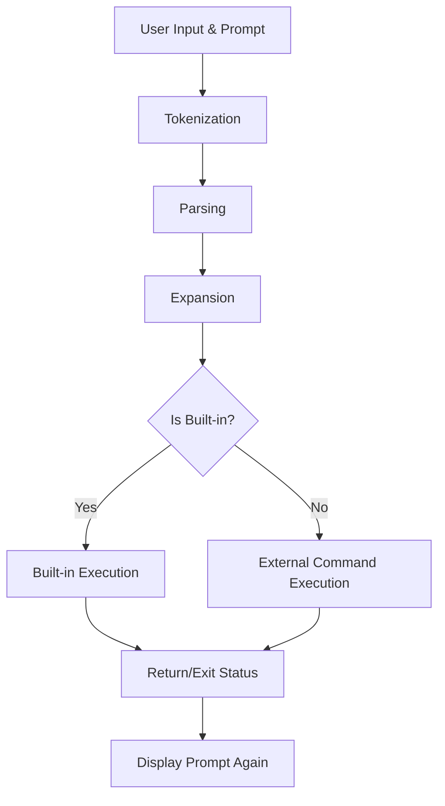

```mermaid
flowchart TD
    A[User Input & Prompt] --> B[Tokenization]
    B --> C[Parsing]
    C --> D[Expansion]
    D --> E{Is Built-in?}
    E -- Yes --> F[Built-in Execution]
    F --> G[Return/Exit Status]
    E -- No --> H[External Command Execution]
    H --> G
    G --> I[Display Prompt Again]

    %% Subcharts references
    click B "./flow_tokenization.md" "Tokenization Details"
    click C "./flow_parsing.md" "Parsing Details"
    click D "./flow_expansion.md" "Expansion Details"
    click F "./flow_builtin_check.md" "Built-in Execution Details"
    click H "./flow_external_exec.md" "External Execution Details"
    click G "./flow_status_prompt.md" "Status/Prompt Details"
```
