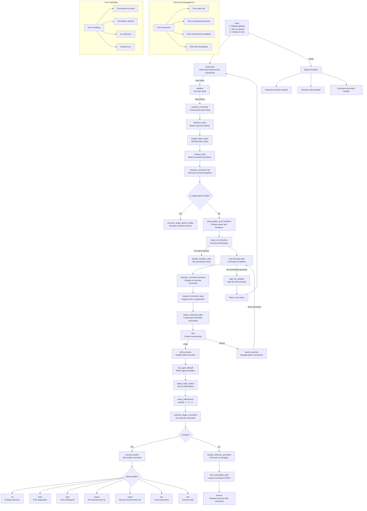

# Minishell: Detailed Execution Flow

```mermaid
flowchart TD
    %% Main Initialization Section
    MAIN[main\n1. Initialize globals\n2. Set up signals\n3. Create env list] --> SHELL_LOOP[shell_loop\nRead input and process commands]
    
    %% Command Processing Flow
    SHELL_LOOP --> |User input| READLINE[readline\nGet user input] 
    READLINE --> |Input string| PROCESS_CMD[process_command\nProcess the input string]
    
    %% Tokenization & Parsing
    PROCESS_CMD --> TOKENIZE[tokenize_input\nBreak input into tokens]
    TOKENIZE --> ASSIGN_TYPES[assign_token_types\nIdentify token types]
    ASSIGN_TYPES --> CREATE_CMDS[create_cmds\nBuild command structures]
    
    %% Command Execution
    CREATE_CMDS --> EXEC_CMD_LIST[execute_command_list\nExecute command pipeline]
    
    %% Parent Builtins Special Path
    EXEC_CMD_LIST --> IS_PARENT_BUILTIN{Is single parent builtin?}
    IS_PARENT_BUILTIN --> |Yes| EXEC_PARENT_BUILTIN[execute_single_parent_builtin\nExecute in parent process]
    
    %% Standard Execution Path
    IS_PARENT_BUILTIN --> |No| SETUP_PIPES[setup_pipes_and_heredocs\nPrepare pipes and heredocs]
    
    %% Heredoc Setup
    SETUP_PIPES --> SETUP_HEREDOCS[setup_all_heredocs\nProcess all heredocs]
    SETUP_HEREDOCS --> |For each heredoc| HANDLE_HEREDOC[handle_heredoc_redir\nSet up heredoc input]
    
    %% Command Process Loop
    SETUP_HEREDOCS --> COMMAND_LOOP[Loop through each command in pipeline]
    COMMAND_LOOP --> EXEC_PROCESS[execute_command_process\nPrepare to execute command]
    
    %% Command Execution Fork
    EXEC_PROCESS --> EXPAND_ARGS[expand_command_args\nExpand vars in arguments]
    EXPAND_ARGS --> SETUP_COMMAND_PIPE[setup_command_pipe\nCreate pipes between commands]
    SETUP_COMMAND_PIPE --> FORK[fork\nCreate new process]
    
    %% Child Process Path
    FORK --> |Child| CHILD[child_process\nHandle child execution]
    CHILD --> SET_SIGS[set_sigint_default\nReset signal handlers]
    SET_SIGS --> SETUP_IO[setup_input_output\nSet up stdin/stdout]
    SETUP_IO --> SETUP_REDIRS[setup_redirections\nHandle < > >> <<]
    SETUP_REDIRS --> EXEC_SINGLE[execute_single_command\nExecute the command]
    
    %% Command Type Decision
    EXEC_SINGLE --> IS_BUILTIN{Is builtin?}
    IS_BUILTIN --> |Yes| EXEC_BUILTIN[execute_builtin\nRun builtin command]
    IS_BUILTIN --> |No| HANDLE_EXTERNAL[handle_external_command\nFind and run program]
    
    %% External Command Execution
    HANDLE_EXTERNAL --> FIND_PATH[find_executable_path\nLocate command in PATH]
    FIND_PATH --> EXECUTE[execve\nReplace process with command]
    
    %% Parent Process & Waiting
    FORK --> |Parent| PARENT[parent_process\nManage pipe connections]
    PARENT --> |Next command| COMMAND_LOOP
    
    %% Wait for Children
    COMMAND_LOOP --> |All commands launched| WAIT[wait_for_children\nWait for all processes]
    WAIT --> EXIT_STATUS[Return exit status]
    EXIT_STATUS --> SHELL_LOOP

    %% Builtins Flow
    EXEC_BUILTIN --> BUILTIN_TYPE{Which builtin?}
    BUILTIN_TYPE --> CD[cd\nChange directory]
    BUILTIN_TYPE --> ECHO[echo\nPrint arguments]
    BUILTIN_TYPE --> PWD[pwd\nPrint working dir]
    BUILTIN_TYPE --> EXPORT[export\nSet environment var]
    BUILTIN_TYPE --> UNSET[unset\nRemove environment var]
    BUILTIN_TYPE --> ENV[env\nList environment]
    BUILTIN_TYPE --> EXIT[exit\nExit the shell]

    %% Signal Handling
    MAIN --> |Setup| SIGNALS[Signal Handlers]
    SIGNALS --> SIG_PROMPT[Interactive prompt handler]
    SIGNALS --> SIG_HEREDOC[Heredoc input handler]
    SIGNALS --> SIG_EXEC[Command execution handler]

    %% Resource Management (shown as a separate process)
    subgraph "Resource Management"
        CLEANUP[Free resources]
        CLEANUP --> FREE_TOKENS[Free token list]
        CLEANUP --> FREE_CMDS[Free command structures]
        CLEANUP --> FREE_ENVS[Free environment variables]
        CLEANUP --> CLOSE_FDS[Close file descriptors]
    end

    %% Error Handling (shown as a separate process)
    subgraph "Error Handling"
        ERRORS[Error handling]
        ERRORS --> CMD_NOT_FOUND[Command not found]
        ERRORS --> PERMISSION_DENIED[Permission denied]
        ERRORS --> IS_DIR[Is a directory]
        ERRORS --> SYNTAX_ERR[Syntax error]
    end
```