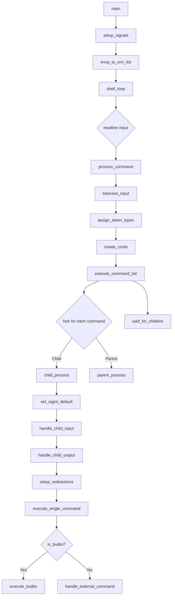

# Minishell Execution Flow

```mermaid
flowchart TD
    A[main] --> B[setup_signals]
    B --> C[envp_to_env_list]
    C --> D[shell_loop]
    D --> E{readline input}
    E --> F[process_command]
    F --> G[tokenize_input]
    G --> H[assign_token_types]
    H --> I[create_cmds]
    I --> J[execute_command_list]
    J --> K{fork for each command}
    K -->|Child| L[child_process]
    K -->|Parent| M[parent_process]
    L --> N[set_sigint_default]
    N --> O[handle_child_input]
    O --> P[handle_child_output]
    P --> Q[setup_redirections]
    Q --> R[execute_single_command]
    R --> S{is_builtin?}
    S -->|Yes| T[execute_builtin]
    S -->|No| U[handle_external_command]
    J --> V[wait_for_children]
```
